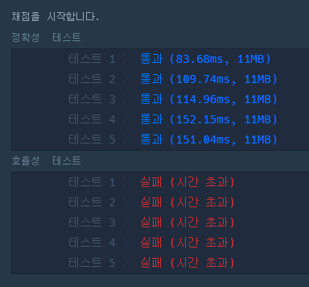
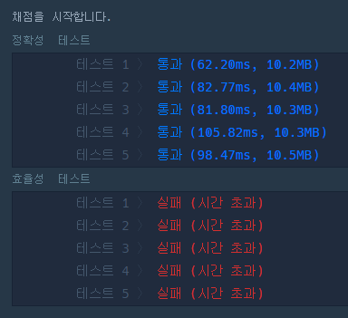
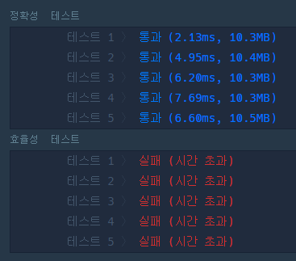

# 1주차 겨울방학 스터디

##

### Q1. Greedy 조이스틱

[풀이](https://github.com/seungsu3579/Algorithm_Study/tree/master/programmers/greedy/조이스틱.py)

---

### Q2. Greedy 단속카메라

[풀이](https://github.com/seungsu3579/Algorithm_Study/tree/master/programmers/greedy/단속카메라.py)

---

주어진 route 중에서 가장 많은 부분이 겹친 point에 cctv를 설치해나가면 최소의 cctv로 모든 차량을 체크할 수 있다.

- solution1 : 처음 시도한 코드. 불필요한 반복이 사용되어 시간복잡도가 매우 큼. 효율성 테스트를 통과하지 못함. 
  

- solution2-1 : 최소한의 반복으로 같은 방식으로 동작. dict 자료구조를 통해 불필요한 반복을 줄임. 효율성 테스트를 통과하지 못함. 
  

- solution2-2 : 트래픽을 기록하는 과정에서 좀 더 개선 
  
