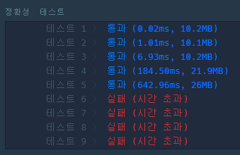

# 3주차 겨울방학 스터디

##

### Q1. dfs/bfs 여행경로

[풀이](https://github.com/seungsu3579/Algorithm_Study/tree/master/programmers/dfs_bfs/여행경로.py)

- solution : dfs로 품. node class를 정의해서 graph 자료구조를 구현. 그저 지나온 길을 체크해두고 오면서 탐색하면 금방 찾음.

이때 같은 티켓이 여러장 있을 수 있는데 이때 길을 체크할 때 여러장을 체크하지 않으면 정확성 테스트1에서 실패. 엣지케이스를 생각하기 어려웠지만 막상 듣고보면 쉬운 문제였음.

---

### Q2. binary_search 입국심사

[풀이](https://github.com/seungsu3579/Algorithm_Study/tree/master/programmers/binary_search/입국심사.py)

- solution1 : 시간복잡도가 문제;; O(klogn)이지만 k가 1 billion, n이 100,000이다. 다시 작성할 필요가 있음. 
  

- solution : 시간을 지정했을 때, 그 때의 처리한 사람 수를 알 수 있다.(O(n)) 따라서 가능한 시간을 binary search하게 움직여 가능한 조건을 만족하는 시간을 찾는다. 이 방법으로도 애를 먹었는데 그 시간에 처리한 사람 조건은 `n보다 크거나 같다` 이지만 `== n` 이라고 잘못 생각해서 시간이 좀 걸렸다.

문제 조건을 보고 인사이트를 가질 수 있도록 해야겠다. 입국심사를 기다리는 사람이 10억이면 바로 log(10억)으로 처리할 수 있는 로직을 생각해보도록 하자.

---

### Q3. dfs-bfs 네트워크

[풀이](https://github.com/seungsu3579/Algorithm_Study/blob/master/programmers/dfs_bfs/네트워크.py)

---

bfs를 while 구문으로 구현하였고 해당 함수로 퍼져 나갈 수 있는 모든 computer들을 set자료구조로 저장해 전체 set에서 차집합을 통해 네트워크로 연결된 computer를 제거 O(n) + O(n). 모든 computer가 체크되면 클러스터 개수를 리턴하도록 함.

set을 통해 더 빠르게 데이터를 제거할 수 있었음. set 관련 메서드의 시간복잡도를 좀더 탐색해보면 좋을 것 같다.
